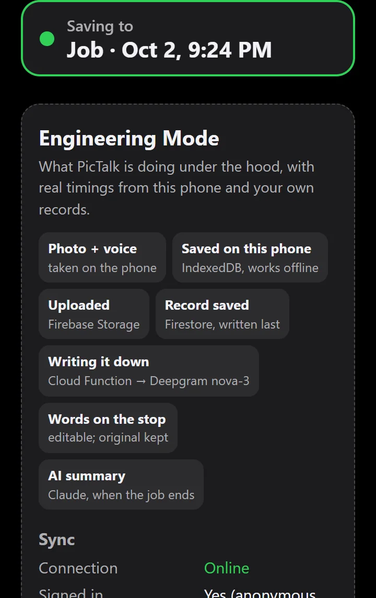
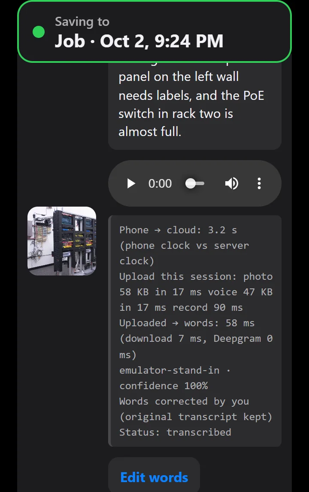
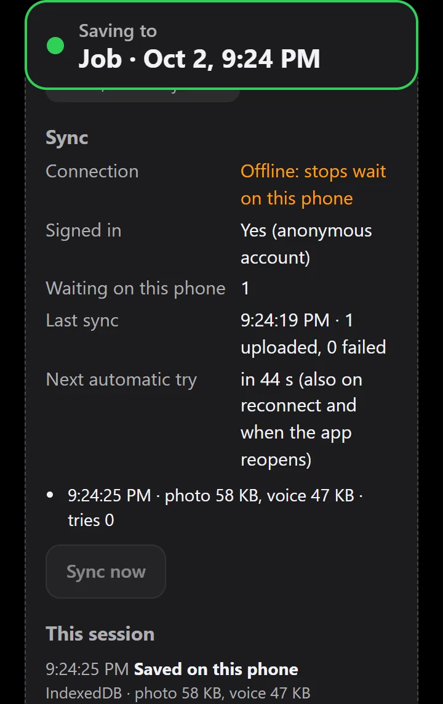
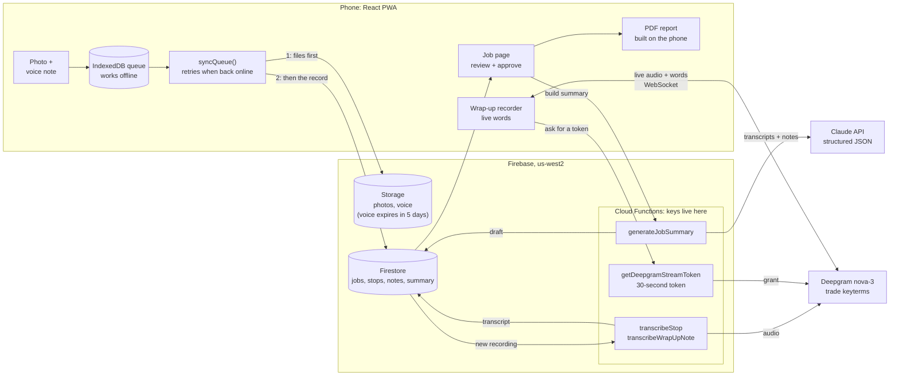
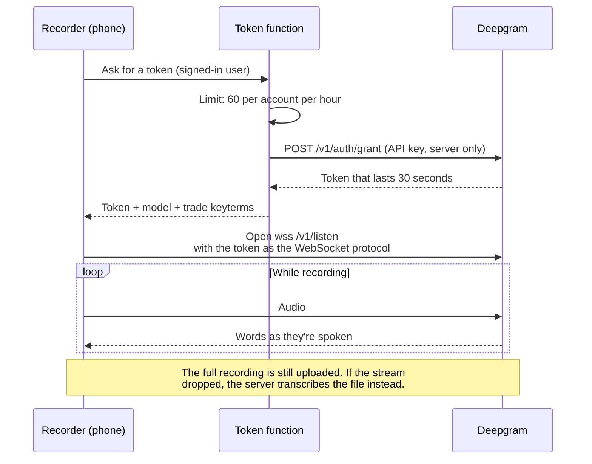

# PicTalk

**Mobile-first AI field documentation for security and low-voltage technicians.**

PicTalk turns a field technician's normal workflow — **take a photo and explain what you see** — into structured job documentation. Technicians capture photos and voice notes at each stop, PicTalk transcribes the recordings, organizes the work by job, drafts an AI summary and action items, and produces a customer-ready PDF after human review.

**Piccolo**, the second pane, takes a finished job the rest of the way: Claude drafts a work order, parts list (BOM), and quote from the job's photos and voice notes, the estimator checks and edits every line, and Piccolo saves numbered, unchangeable finals to export or share with a team.

> Built as a practical field workflow: **Photo → Voice → Transcript → Job Context → AI Draft → Human Approval → PDF Report → Work Order, Parts, and Quote**

**Try it live:** https://pictalk-6cbff.web.app  
**Portfolio case study:** https://ky-gray-portfolio.vercel.app/#pictalk  
**How it's built:** [Architecture](#high-level-architecture) · [Evaluation Lab](#evaluation-lab) · [Run it locally](#run-it-locally)

> **Demo note:** Open it on your phone. No sign-up is needed: take a photo, tap to talk, and save a stop. End the job to see the AI summary and download the PDF. To see the pipeline behind it, tap **Engineering Mode** at the bottom of the main screen. Then tap **Piccolo** at the top to turn a finished job into a work order, parts list, and quote; Piccolo needs a quick sign-in (Google or an emailed link), and your PicTalk jobs come with you. Demo limits: up to 10 stops per job, and voice recordings are deleted after 5 days. Please don't record real customer information.

## Works with no signal

Add PicTalk to your phone's home screen: tap **Install PicTalk on this phone** at the bottom of the main screen. In Chrome on Android it opens Chrome's install dialog; on an iPhone (which never offers a one-tap install), and in Firefox, DuckDuckGo, or Samsung Internet, it opens a step-by-step guide with pictures of the real buttons. On an iPhone in Safari: tap **⋯** next to the address bar, **Share**, **Add to Home Screen**, keep **Open as Web App** on, and tap **Add**. From then on it opens from its own icon even with no signal, in a basement, an equipment room, or a dead zone, and you keep working: start and end jobs, take photos, record voice notes, and save stops. Everything waits safely on the phone. When signal returns, PicTalk uploads it and the voice notes are written down automatically, with nothing to tap. Tapping **Describe photo** with no signal works the same way: the photo is described once the phone is back online. ([How it works](#offline-first-architecture) · [How it's tested](#evaluation-lab))

## Three ways to explore

**Field view (default).** What a technician sees: start a job, photograph each stop, talk, and save. Everything is plain language ("Saved on this phone", "Writing it down…"), and it keeps working with no signal.

**Engineering Mode.** Tap the small **Engineering Mode** link at the bottom of the main screen to see what the app is doing underneath: stops waiting on the phone, upload retries and errors, the next automatic sync, and real timings for each stop (upload per file, then transcription split into audio download and Deepgram time), plus how long each AI summary took and how many tokens it used. It's off by default, so field techs never see it, and it only shows each user their own data. [Full details below.](#engineering-mode)

<p>
  
</p>

**Evaluation Lab.** The **Evaluation Lab** link at the bottom of the main screen ([pictalk-6cbff.web.app/lab](https://pictalk-6cbff.web.app/lab)) shows the results of an offline simulator that uses the app like a field tech, cuts the signal at the worst moments (mid-recording, mid-upload, mid-sentence of live words, app closed while offline), and checks that every recording still reaches the cloud whole and gets written down. It also lists the problems it caught and what was fixed. [Full details below.](#evaluation-lab)

## The problem

Field technicians often finish a site walk with useful information scattered across camera rolls, handwritten notes, text messages, and memory. Turning that information into something useful for sales, service, estimating, or project management takes additional office time and can lose important field context.

PicTalk is designed to capture that information **while the technician is already standing in front of the equipment**.

## Workflow

1. **Start a job** and identify the customer/location.
2. **Take a photo** at a device, room, panel, or other field stop.
3. **Tap to talk** and describe the condition, finding, or required work.
4. PicTalk saves the stop locally first and synchronizes it to the cloud when connectivity is available.
5. **Deepgram** converts the technician's voice note into searchable text using terminology relevant to security and low-voltage work.
6. The technician can review or correct the transcription, tap **Describe photo** to have Claude describe what's in the picture (readable labels and model numbers, visible condition), and add optional end-of-job field/customer notes.
7. **Claude** uses the job's transcripts, photo descriptions, and wrap-up notes to draft a concise job summary and prioritized action items.
8. The technician reviews and edits the AI output before approving it.
9. PicTalk generates a **PDF job report** containing the approved summary, action items, job details, photos, and field documentation.

## Piccolo: from site walk to quote

Piccolo turns a finished PicTalk job into the documents that come next, with the estimator in charge of every line.

- **AI draft from the job itself.** Claude reads the stops (words, photo descriptions, and the photos), the wrap-up notes, and the job summary, and writes a work order (scope, locations with tasks, customer requirements, installation notes), a parts and labor list, and open questions. There's no parts catalog to set up.
- **Guardrails enforced in code, not just asked for.** Every line links back to the stop or note it came from (tap to jump to the photo). A part number counts as the technician's only if it was actually said or written; anything else is marked **Verify part #**. Lines the AI assumed are marked **Inferred · check**. Prices stay blank unless they come from the company's labor rate, the same item on an earlier final, or AI estimates the company turned on (always marked **ESTIMATE**).
- **Edit everything.** Lines, quantities, part numbers, prices, scope, tasks, and questions, with undo, saving on the phone first. A newer draft never overwrites the user's copy; they can compare and pull in only what they want.
- **Finalize and export.** Finalizing lists anything still unchecked, then saves an unchangeable numbered version (v1, v2…) with its own copies of the photos and audio. Exports: a PDF with any of work order (no prices), parts list, and quote; parts and quote CSV files; or the full package as JSON.
- **Teams and roles.** A company admin invites people as estimator (everything, including prices), field tech (jobs, photos, and the price-free work order), or installer (only the work orders assigned to them). Prices are kept out of what field techs and installers can read, by the security rules rather than just by hiding them in the app.
- **Admin console.** People and invites, every company job with its sales status (captured, drafted, quoted, won, lost, installed), customers, quote defaults (number prefix, markup, tax, labor rate, terms), an activity log, storage used, and export everything.
- **Learns from edits.** Each final records what changed from the AI's draft. Later drafts reuse the company's own wording, part numbers, and last quoted prices, marked **Part # from a past quote** and **Last quoted price**. Each company's history stays its own, and a company can turn it off or clear it.

## Screenshots

### Capture a field stop


### Record a voice note


### Review saved stops and transcripts


### AI-generated job summary and action items


### Customer-ready job report


## Key capabilities

- **Mobile-first PWA** designed for field use: installs to the home screen and opens with no signal
- **Offline-first capture** using IndexedDB so a technician can save work before cloud connectivity is available
- Job-based organization with multiple photo/voice stops: a My Jobs list, rename and reopen jobs, customer and location names, moving or deleting stops, and adding or replacing a saved stop's photo (moving and photos work offline)
- Browser microphone selection for field laptops and external microphones
- Cloud synchronization of photos, audio, jobs, and transcripts
- **Deepgram Nova-3 speech-to-text** with security/low-voltage terminology
- Editable transcripts while retaining the original transcription
- **AI photo descriptions on request:** a Describe photo button on each stop has Claude describe the photo (what it shows, readable text such as labels and model numbers, and visible condition), using the voice note as context. The description shows under the words with Edit and Delete buttons, goes into the PDF and the job summary, and works offline (it's written once the phone has signal)
- Optional field wrap-up notes and customer comments, with **words shown live while the technician talks** (Deepgram streaming)
- **Claude-powered job summaries and action items**
- Human review and approval before AI-generated content is included in the final report
- PDF export with job information, photos, findings, summary, and action items
- PDF delivery that fits the device: on a phone, Share PDF (Web Share) comes first; on a computer, Download PDF saves the file and Share PDF is the second option
- Automatic voice-note retention policy designed to reduce unnecessary long-term audio storage
- **Engineering Mode:** an opt-in inside view of the capture pipeline with real timings, sync status, and AI usage
- **Evaluation Lab:** an offline simulator with a public scorecard and fixes log
- **Piccolo:** AI-drafted work orders, parts lists, and quotes with code-enforced guardrails, full editing, numbered finals, PDF/CSV/JSON export, team roles with price-free views, an admin console, and drafts that learn from each company's finals
- Accounts when they're needed: PicTalk works without one; signing in (Google or an emailed link) keeps the same account and jobs

## AI with human review

PicTalk deliberately treats AI output as a **draft**, not as an unquestioned final answer.

The AI summary is created from the technician's captured job information. The technician can review and edit both the summary and action items. Only an **approved** summary is included in the final PDF report.

Photo descriptions work the same way: each one is labeled as a photo description, kept separate from the technician's own words, and can be edited or deleted, so the technician can check what the AI saw before it feeds the job summary. In the summary the technician's own words win when they disagree with a description.

If underlying transcripts, photo descriptions, or wrap-up notes change after generation, the application can identify that the existing AI summary is out of date and should be reviewed again.

This workflow keeps the technician responsible for the final field record while using AI to reduce the administrative work required to turn raw notes into useful documentation.

## Offline-first architecture

Field technicians cannot assume reliable Wi-Fi or cellular service inside electrical rooms, MDF/IDF rooms, warehouses, parking structures, or large facilities.

PicTalk therefore saves a new stop to **IndexedDB first**, including its photo and audio. A synchronization queue uploads pending work to Firebase when connectivity becomes available and retries automatically after network changes, sign-in, application visibility changes, and scheduled retry intervals.

This architecture allows capture to continue even when the cloud is temporarily unavailable.

The app itself also works with no signal. A hand-written service worker saves every file of the current build at install, including the PDF tools that only load on first export. The build lists those files and stamps a version into the worker, so each new release replaces the saved copy in one step. Opening the app tries the network for up to 4 seconds, then uses the saved copy. Firebase traffic is never cached.

## Live transcription without exposing the API key

Wrap-up notes show words on screen while the technician talks. A Cloud Function exchanges the server-held Deepgram key for a token that lasts 30 seconds, just long enough for the phone to open a WebSocket to Deepgram's streaming API. The phone streams quarter-second audio chunks; words appear gray while Deepgram is still deciding and white once final. Pausing closes the connection so silence isn't billed. The full recording is always kept and uploaded afterward: if the live connection stayed up, its words become the transcript, and if it dropped (or the phone lost signal, which counts as a drop straight away), a Cloud Function transcribes the whole recording instead. Text the technician typed is never overwritten. ([Diagram](#live-words-without-exposing-the-deepgram-key))

## Engineering Mode

An offline-first app hides its hardest work: queued uploads, retries, and background transcription. **Engineering Mode** makes that work visible and measurable. A small link at the bottom of the app turns it on. It's off by default, so field technicians never see it, and it only shows each user their own data.

<p>
  
  
  
</p>

| Area | What it shows | Where the numbers come from |
| --- | --- | --- |
| Data path | The 7 steps a stop takes: phone → IndexedDB → Storage → Firestore → Cloud Function → Deepgram → Claude | — |
| Sync | Online/offline, stops waiting on the phone, upload tries, last error, last sync result, countdown to the next automatic try, **Sync now** | The sync queue, in the browser |
| Each stop | Time to reach the cloud, upload time per file, transcription time split into **audio download** and **Deepgram**, recording length, speed vs. real time, model, confidence, whether the words were corrected | Browser timings + fields the transcription function saves (`transcribeTimings`) |
| Live words | Token request time, connection time, time to first words, and why it fell back to after-recording transcription | The browser |
| AI summary | Model used, generation time, attempts, input/output tokens, summaries used of 5 | Fields the summary function saves (`generation`) |
| Session log | Each step as it happens: saved on the phone, uploaded, failures | Memory only; never stored |

**Why it matters:** it shows whether a slow stop was the phone's signal, the upload, or the speech-to-text service; whether the retry loop really recovers after a dead zone; and what each AI summary costs in time and tokens.

*The screenshots above were taken in the local Firebase emulator, where speech-to-text and the AI are free stand-ins, so their times show near zero. Upload, sync, and offline timings are real browser measurements.*

## Evaluation Lab

Offline-first is easy to claim and hard to prove by hand. The Evaluation Lab is a simulator (`lab/simulate.js`) that builds the real production app, opens it in headless Chrome at phone size, and drives it the way a technician would: real file picker, a test microphone, real taps. It runs against the local Firebase emulators. "Signal off" cuts the network for both the page and the app's service worker, like airplane mode. Results are published at **[/lab](https://pictalk-6cbff.web.app/lab)** as a scorecard, the checks behind each scenario, and a fixes log.

| Scenario | What happens | What it proves |
| --- | --- | --- |
| No signal from the start | Stops saved with no signal, then signal returns | Queued stops upload and get written down |
| Signal lost mid-recording | Signal drops while a voice note is recording | The recording isn't cut short |
| Signal lost mid-upload | Photo uploads, then signal drops as the voice note starts uploading | Clean retry: nothing missing, nothing doubled, no stray files |
| Live words drop mid-sentence | Wrap-up note loses signal partway; a second note stays connected as a control | Dropped notes are written down from the whole recording |
| Flaky signal through a full job | Signal flips every 3 seconds across a 10-stop job | No stops lost, doubled, or out of order |
| App closed and reopened with no signal | Stops saved offline, app closed and reopened still offline | Waiting work survives a restart; the app opens with no signal |
| Opening the app in airplane mode | One visit with signal, then opened fresh in airplane mode | Every app file is on the phone, PDF tools included |

**How it checks "nothing lost".** The emulator's stand-in transcriber reports how many bytes of audio it received, and the lab compares that with the size of the stored file, which proves each recording was written down from the whole file. It also decodes every stored recording in the browser and compares its length with how long the microphone was held, and confirms nothing was in the cloud before signal returned (so the cut was real).

**Caught and fixed on the first run (October 2026):**

- **Live words dropping mid-sentence could lose words.** The recorder waited for the live connection to report that it had dropped. If it never did, the note kept only the words heard before the drop. Now losing signal counts as a drop straight away, and the whole recording is written down after upload.
- **The PDF tools weren't saved for offline use**, so a first export with no signal could fail. Now every file is saved at install.
- **The saved copy was ignored when the server sent a `Vary` header** (the lab's test server does; Firebase Hosting currently doesn't). App files are now matched by name.

**Not measured yet:** real transcription accuracy (the stand-in doesn't hear words), real phones and cell networks (times after signal returns are local and near zero), weak-but-not-zero signal, and long recordings.

```bash
firebase emulators:start --only auth,firestore,storage,functions   # with PICTALK_FAKE_STT=1
node lab/simulate.js            # every scenario, 3 runs each; --only <id>, --runs <n>, --save
```

## Technology stack

| Layer | Technology |
| --- | --- |
| Front end | React 19, Vite, JavaScript/JSX |
| Application model | Progressive Web App (PWA) |
| Offline storage | IndexedDB / `idb-keyval` |
| Authentication | Firebase Authentication: anonymous guests, then Google or email link on the same account |
| Database | Cloud Firestore |
| File storage | Firebase Storage |
| Backend | Firebase Cloud Functions |
| Speech-to-text | Deepgram Nova-3 |
| AI summaries, photo descriptions, and Piccolo drafts | Anthropic Claude |
| PDF generation | jsPDF |
| Tests | Node test runner against the Firebase emulators (security rules and Cloud Functions) |
| Hosting | Firebase Hosting |

## High-level architecture

The phone does the capturing and the queueing; Firebase stores everything; Cloud Functions hold every API key and do the transcription and summaries.



Files upload before the Firestore record is written, so a record never points at a missing photo. The client-made ID is the record's ID, so a retried upload can't create a duplicate.

### Live words without exposing the Deepgram key



## Data and security design

PicTalk uses per-user Firebase paths for job and stop data, with Firebase Security Rules restricting access to the authenticated owner. Storage rules restrict field media by owner, file type, and size.

Piccolo adds companies and roles. A job stays under the person who captured it; sharing it with their company lets teammates read it according to their role. Roles, company membership, invites, and the activity log are written only by Cloud Functions, so nobody can give themselves access. Field techs and installers read a separate price-free copy of the work order, so prices never reach their phones. Finals are written only by a function and can't be changed afterward.

The AI summarization function reads the authenticated user's job context and writes the generated draft back to that user's job. API credentials for external AI and transcription services are handled as backend function secrets rather than exposed in the browser application.

Audio is intentionally treated as temporary working data. The application is designed around a five-day voice-file retention period while keeping the resulting transcript as part of the job record.

## AI usage controls

To keep AI use predictable, the summary function allows 5 summaries per job and 20 per account per day, the photo description function allows 3 descriptions per stop and 30 per account per day, and the live-words token function allows 60 connections per account per hour. Piccolo drafts need a signed-in account and are limited to 10 per account per day and 5 per job, and every AI call in the app counts toward an overall daily cap. These limits are enforced in Cloud Functions, not in the browser. AI-generated summaries also preserve metadata needed to distinguish drafts from approved content.

The summary is generated from the text associated with the job, including photo descriptions; photos and audio recordings themselves are not sent to the summarization model. A photo is sent to Claude only when the technician taps **Describe photo** on that stop. It is shrunk to 1600 pixels on the long side first, and the description is written back onto the stop.

## Why I built it

PicTalk combines my background in **physical security, field sales engineering, low-voltage systems, and AI application development**.

The goal was not simply to add an AI chat box to a field application. The goal was to design an end-to-end workflow where AI removes a specific operational bottleneck: converting field observations into usable documentation for the people who need to act on them next.

That includes understanding the realities of field work — intermittent connectivity, hands-busy operation, photos as evidence, trade terminology, quick capture, technician review, and a clean handoff to the next person in the workflow.

## Current project status

PicTalk is an actively developed demonstration application. Current functionality includes job organization, offline capture and synchronization, photo and voice stops, transcription, live words for wrap-up notes, editable field notes, AI-generated summaries and action items, AI photo descriptions, human approval, PDF job reporting, an installable app that opens with no signal, Engineering Mode, the Evaluation Lab, and Piccolo (AI-drafted work orders, parts lists, and quotes, with accounts, teams, and an admin console).

The current demo limits a job to 10 stops. Voice recordings are designed to expire after five days.

## Run it locally

Needs Node 24 and, for the emulators, the Firebase CLI and Java 11+.

```bash
npm install
npm run dev        # Vite dev server against the local Firebase emulators (the service worker only runs in production builds)
npm run build      # production build into dist/, which Firebase Hosting serves
npm run lint
npm test           # starts the emulators and runs the security-rule and Cloud Function tests in tests/
```

To test without touching the live Firebase project, use the emulators. One command sets them up with free stand-ins for Claude and Deepgram, so no API keys are needed:

```bash
npm run setup:emulator     # creates the two local settings files below and installs the functions' dependencies
npm run emulators          # every emulator, as the offline-only project demo-pictalk
npm run dev                # in a second terminal: the app talks to the emulators
```

| Setting | Where | What it does |
| --- | --- | --- |
| `ANTHROPIC_API_KEY` | `functions/.secret.local` (emulator), Firebase secret (production) | Claude API key for summaries and photo descriptions. Dummy value is fine with the stand-in on |
| `DEEPGRAM_API_KEY` | same | Deepgram key for transcripts and live-word tokens. Live words need a Member-role key |
| `PICTALK_FAKE_AI=1` | `functions/.env.local` | Stand-in summaries, photo descriptions, and Piccolo drafts instead of the Claude API (emulator only) |
| `PICTALK_FAKE_STT=1` | `functions/.env.local` | Stand-in transcripts and live words instead of Deepgram (emulator only) |
| `VITE_USE_EMULATORS=true` | `.env.development` (used by `npm run dev`) | Points the dev app at the local emulators |

The setup script copies `functions/.secret.local.example` and `functions/.env.local.example`; the copies are git-ignored and never overwritten. In production the keys are set with `firebase functions:secrets:set ANTHROPIC_API_KEY` (and `DEEPGRAM_API_KEY`). The Firebase web config in `src/firebase.js` is public by design and needs no setting. Browser test scripts are in `e2e/`; the offline simulator is in `lab/` ([Evaluation Lab](#evaluation-lab)).

## Repository notes

This repository is public. API keys for Deepgram and Anthropic are Firebase Functions secrets and never appear in the code. The Firebase web config in the app is public by design: Firestore and Storage security rules (`firestore.rules`, `storage.rules`) are what keep each user's data private to them.

---

**Designed and developed by Ky Gray**  
Security Solutions Engineer · AI/SaaS Product Builder

© 2026 Ky Gray. All rights reserved.
